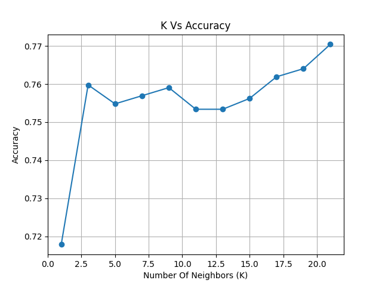
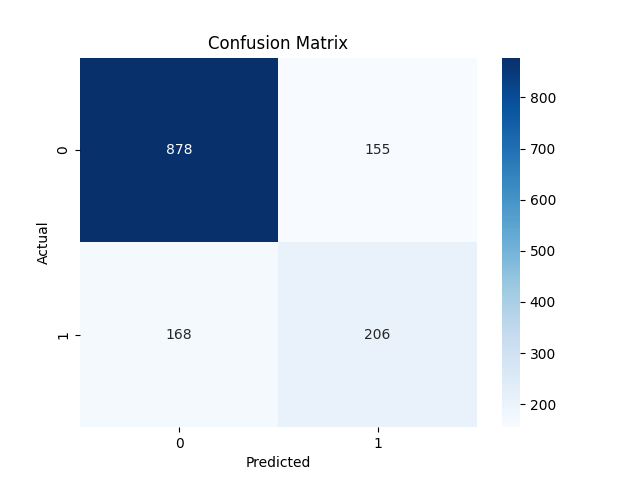

# Customer Churn Prediction using KNN

## Project Overview

This project predicts whether a customer will leave the telecom company using the K-Nearest Neighbors (KNN) algorithm.

---

## Dataset

- Telco Customer Churn Dataset

---

## Project Workflow

1. Data Exploration (EDA)
2. Data Cleaning
3. Data Preprocessing
4. Feature Encoding
5. Train/Test Split
6. Feature Scaling
7. KNN Training
8. Hyperparameter Tuning
9. Model Evaluation

---

## Technologies Used

- Python
- Pandas
- NumPy
- Matplotlib
- Seaborn
- Scikit-learn

---

## Model

Algorithm:

- K-Nearest Neighbors (KNN)

Best K:

21

Accuracy:

77.04%

---

## Evaluation

- Accuracy Score
- Confusion Matrix
- Classification Report

---

## Visualizations

- K vs Accuracy
  
- Confusion Matrix
  
